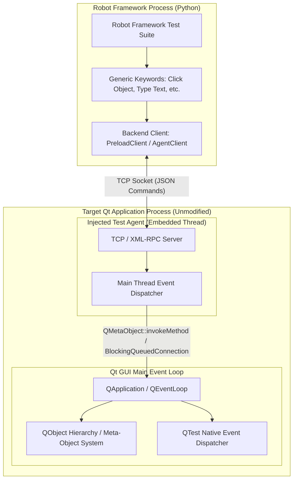

# robotframework-qtexpert

A unified Robot Framework library for automating and testing Qt desktop applications. Built as a high-precision, open-source alternative to Froglogic Squish, it supports both Linux Qt5/Qt6 applications and cross-platform automation on Linux, Windows, and macOS.

---

## 🚀 Key Features

- **Tri-Mode Architecture**:
  1. **Preload / Injected C++ Agent (`mode=preload`)**: Zero code changes! Injects into any compiled C++ or Python Qt5 binary on Linux using `LD_PRELOAD` (Squish alternative).
  2. **In-Process Python Agent (`mode=agent`)**: Thread-safe Qt main GUI thread dispatching for Python Qt applications (PyQt5, PySide2, PyQt6, PySide6).
  3. **Accessibility Mode (`mode=a11y`)**: Non-invasive OS-level accessibility testing (AT-SPI on Linux, UIA on Windows, AX on macOS).
- **Universal Qt Component Support**:
  - **Checkboxes & Radios**: `QCheckBox`, `QRadioButton` (with smart indicator-aligned click targeting).
  - **Dropdowns & Selectors**: `QComboBox`, `QTabWidget` (with automatic ancestor tab switching).
  - **Sliders & SpinBoxes**: `QSlider`, `QSpinBox`, `QDoubleSpinBox`.
  - **Text & Verification**: `QLineEdit`, `QTextEdit`, `QPlainTextEdit`, `QLabel` (including HTML hyperlinks).
  - **Indicators**: `QProgressBar`, status banners, custom properties.
- **100% Thread-Safe on Linux**: Safely marshals network RPC commands into Qt's native GUI event loop via `QMetaObject::invokeMethod` / `BlockingQueuedConnection` to avoid X11 protocol desynchronization or GUI crashes.
- **Squish-Style Locators**: Identify controls with multi-attribute selectors (e.g. `type=QPushButton text=Login`, `name=userInput`, `window="MainWindow" visible=true`).
- **Realistic Event Synthesis**: Dispatches native Qt mouse and keyboard interactions using `QTest::mouseClick`, `QTest::mouseDClick`, and `QTest::keyClicks`.
- **Live Object Spy & UI Coverage**:
  - `Dump Object Tree`: Exports full widget hierarchies, types, and properties to JSON without needing access to application source code.
  - `Generate UI Coverage Report`: Produces interactive HTML reports tracking screen and component test coverage.
- **Headless CI/CD & VNC Ready**: Run headlessly under `Xvfb` or view tests running live via VNC (`localhost:5900`).

---

## 💡 How It Works (Architecture & Concepts)



### 1. Dynamic Injection via `LD_PRELOAD`
On Linux, the dynamic linker loads `libqt_test_agent.so` before the target application executes. A C++ constructor (`__attribute__((constructor))`) runs prior to `main()`, spawning a lightweight background monitor thread that detects `QCoreApplication::instance()` as soon as the app starts.

### 2. Isolated IPC Bridge
The agent binds to a local TCP socket (default port `9988`). Robot Framework runs independently in its own process, communicating with the agent via newline-delimited JSON commands. If the target application crashes, the test suite catches the socket error cleanly rather than crashing.

### 3. Main GUI Thread Safety
Qt strictly forbids background threads from modifying GUI widgets directly. The agent uses Qt's meta-object invocation (`QMetaObject::invokeMethod` with `Qt::BlockingQueuedConnection` in C++, custom `QEvent` dispatcher in Python) to safely enqueue commands onto the main GUI thread and block until completion.

### 4. Dynamic Object Resolution & Auto-Tab Activation
Locators like `name=myInput` or `type=QPushButton text="Save"` are resolved dynamically by querying `QApplication::topLevelWidgets()` and traversing the `QObject` parent-child tree. If an element is located inside a hidden tab of a `QTabWidget`, the agent automatically traverses up the ancestor hierarchy, selects the appropriate tab page, and brings the widget into view before interacting with it.

### 5. Application Agnostic
Because the agent queries Qt's internal **Meta-Object System** (`QObject`, `QMetaObject`, `Q_PROPERTY`), it works out-of-the-box across any standard Qt5/Qt6 desktop application without needing application-specific modifications.

---

## 📊 Mode Comparison

| Feature | Injected C++ Agent (`preload`) | In-Process Python Agent (`agent`) | Accessibility (`a11y`) |
| :--- | :--- | :--- | :--- |
| **Linux Qt5 Reliability** | **Extremely High** | **Very High** | Medium |
| **Code Changes to App** | **Zero** (Binary injection) | Minimal (Import `start_agent`) | None |
| **Target App Languages** | C++, Python, or any Qt5 binary | Python (PyQt5, PySide2, PyQt6, PySide6) | Any |
| **Locator Engine** | Squish-style multi-attribute | Squish-style multi-attribute | Accessible name & role |
| **Qt Introspection** | Direct `QMetaObject` & `Q_PROPERTY` | Full Python & Qt object model | Limited to OS Accessibility |
| **Primary Use Case** | Closed-source or compiled Linux Qt5 apps | In-house Python Qt applications | Third-party / black-box tests |

---

## 🛠️ Linux Qt5 Quick Start

### 1. Injected C++ Agent Mode (`mode=preload`)

Build the agent shared library once on Linux:
```bash
./build_agent.sh
```

Write your Robot Framework test:
```robot
*** Settings ***
Documentation     Injected C++ Agent Test (Squish Alternative for Linux Qt5)
Library           qtexpert    mode=preload    default_port=9988
Suite Teardown    Close Application

*** Variables ***
${APP_PATH}       ${CURDIR}/mock_app/build/qt5_mock_app
${AGENT_SO}       ${CURDIR}/../cpp_agent/build/libqt_test_agent.so

*** Test Cases ***
Launch And Authenticate
    Start Application With Qt Agent    ${APP_PATH}    ${AGENT_SO}    port=9988
    Wait For Object                    name=usernameInput    timeout=10

    # Click HTML Hyperlink inside QLabel
    Click Link                         name=docLinkLabel
    Object Property Should Be          name=docStatusLabel      text    Safety Protocol: Reviewed & Interlock Accepted

    # Checkbox interaction
    Select Checkbox                    name=rememberMeCheck
    Checkbox Should Be Checked         name=rememberMeCheck

    # Input text using native QTest keyboard simulation
    Type Text Into Object              name=usernameInput    admin
    Type Text Into Object              name=passwordInput    secret123
    Click Object                       name=loginButton
    Object Property Should Be          name=statusLabel      text    Login Successful!

Test Route Alignment With Dropdown Radios And Checkboxes
    Select Tab                         name=mainTabWidget    Route Alignment

    # Radio Button selection
    Select Radio Button                name=radioHazmat
    Radio Button Should Be Selected    name=radioHazmat
    Radio Button Should Not Be Selected    name=radioExpress

    # Dropdown / ComboBox selection
    Select Combo Option                name=optionsCombo    Track 3 - Intermodal Container Yard
    Combo Option Should Be             name=optionsCombo    Track 3 - Intermodal Container Yard

Test Sliders SpinBox And Multi-Line Text
    Select Tab                         name=mainTabWidget    Yard Operations

    # Slider control
    Set Slider Value                   name=humpSpeedSlider    40
    Slider Value Should Be             name=humpSpeedSlider    40

    # SpinBox control
    Set Spinbox Value                  name=wagonCountSpin     35
    Spinbox Value Should Be            name=wagonCountSpin     35

    # Multi-line text edit
    Clear And Type Text                name=shiftNotesEdit     Consist cleared on track 3.
    Text Should Contain                name=shiftNotesEdit     cleared on track 3

Export Object Spy Tree & Coverage
    Dump Object Tree                   output_file=results/ui_tree.json
    Generate UI Coverage Report        output_html=results/coverage.html
```

---

### 2. In-Process Python Agent Mode (`mode=agent`)

In your Python Qt application entrypoint:
```python
import os
from PyQt5.QtWidgets import QApplication

app = QApplication(sys.argv)
window = MainWindow()
window.show()

# Start test agent if port file path is requested by test runner
if 'QT_AGENT_PORT_FILE' in os.environ:
    from robotframework_qtexpert.agent import start_agent
    agent = start_agent(app)
    with open(os.environ['QT_AGENT_PORT_FILE'], 'w') as f:
        f.write(str(agent.port))

sys.exit(app.exec_())
```

In your Robot Framework test:
```robot
*** Settings ***
Library           qtexpert    mode=agent
Suite Teardown    Close Application

*** Variables ***
${APP_CMD}        python3 my_qt_app.py
${PORT_FILE}      ${TEMPDIR}/qt_port.txt

*** Test Cases ***
Interact With Qt5 Controls
    Launch Application    ${APP_CMD}    port_file_path=${PORT_FILE}
    Wait For Object       name=usernameInput    timeout=10
    Type Text Into Object name=usernameInput    admin
    Click Object          name=loginButton
    Object Property Should Be    name=statusLabel    text    Login Successful!
```

---

## 🔍 Squish-Style Locator Syntax

Widgets can be targeted using multi-attribute selectors or raw object names:

| Syntax | Example | Description |
| :--- | :--- | :--- |
| **Object Name** | `name=submitButton` or `submitButton` | Matches `QObject::objectName()` |
| **Class & Text** | `type=QPushButton text="Login"` | Matches Qt class and button label |
| **Window & Type** | `window="MainWindow" type=QLineEdit` | Scopes search to a specific window |
| **State Filter** | `name=saveBtn visible=true enabled=true` | Matches only active controls |
| **Dictionary** | `{"objectName": "btn", "visible": True}` | Direct Python dictionary |

---

## 📚 Keyword Reference

### Application Lifecycle
- `Launch Application | command, [mode], [window_title], [port_file_path], [agent_so_path], [port], [timeout]`
- `Start Application With Qt Agent | application_path, agent_so_path, [arguments], [port], [timeout]`
- `Connect To Qt Agent | [host], [port], [timeout]`
- `Close Application`

### Component Actions & Automation
- `Click Object | locator, [button='left'], [x=-1], [y=-1], [double=False]`
- `Double Click Object | locator`
- `Right Click Object | locator`
- `Type Text Into Object | locator, text, [delay_ms=-1]`
- `Clear Text | locator`
- `Clear And Type Text | locator, text`
- `Press Key On Object | locator, key, [modifiers='']`
- `Select Tab | locator, tab`
- `Click Link | locator, [link_target='']`

### Checkboxes & Radio Buttons
- `Select Checkbox | locator`
- `Unselect Checkbox | locator`
- `Checkbox Should Be Checked | locator`
- `Checkbox Should Not Be Checked | locator`
- `Select Radio Button | locator`
- `Radio Button Should Be Selected | locator`
- `Radio Button Should Not Be Selected | locator`

### Dropdowns, Sliders & SpinBoxes
- `Select Combo Option | locator, option`
- `Combo Option Should Be | locator, expected_option`
- `Set Slider Value | locator, value`
- `Slider Value Should Be | locator, expected_value`
- `Set Spinbox Value | locator, value`
- `Spinbox Value Should Be | locator, expected_value`

### Assertions & State Verification
- `Get Object Property | locator, property_name`
- `Set Object Property | locator, property_name, value`
- `Object Property Should Be | locator, property_name, expected_value`
- `Text Should Be | locator, expected_text`
- `Text Should Contain | locator, expected_substring`
- `Object Should Exist | locator`
- `Object Should Not Exist | locator`
- `Wait For Object | locator, [timeout=10.0], [poll_interval=0.2]`
- `Wait For Object To Disappear | locator, [timeout=10.0], [poll_interval=0.2]`

### Object Spy & UI Coverage
- `Dump Object Tree | [output_file], [root_locator]`
- `Get UI Coverage`
- `Generate UI Coverage Report | [output_html], [output_json]`

---

## 🔍 Independent Desktop Object Spy GUI (`qtexpert-spy`)

`robotframework-qtexpert` includes an independent, standalone desktop UI inspection tool (similar to **Froglogic Squish Object Spy** or Windows **Inspect.exe**). It connects to any running Qt application on Linux and visually inspects controls in real-time.

```bash
# Launch the standalone visual inspector
qtexpert-spy --host 127.0.0.1 --port 9988
```

### Key Spy Capabilities:
- **Interactive Hierarchy Tree**: Real-time searchable tree of all `QWidget`s, geometry coordinates, visibility, and labels.
- **Instant Locator Generation**: Auto-generates the best Robot Framework locators (`name=...`, `type=... text=...`) with one-click clipboard copy.
- **Live Action Testing Sandbox**: Send live clicks and keypresses to the target app directly from the Spy window to verify locators before writing tests.
- **Export to JSON**: One-click dump of the entire application structure.


---

## 🐳 Docker & Headless CI/CD Testing

To run tests in an isolated headless environment:

```bash
# Build and run tests inside Docker container
docker build -t qtexpert-gui .
docker run -d --name qtexpert-gui -p 5900:5900 -v $(pwd):/workspace qtexpert-gui

# Run Robot Framework test suites
docker exec qtexpert-gui robot --pythonpath src --outputdir results tests/docker_qt5_test.robot
docker exec qtexpert-gui robot --pythonpath src --outputdir results tests/preload_test.robot
```

### Viewing Live Execution via VNC
Connect to `localhost:5900` using any VNC Viewer (e.g. RealVNC, TigerVNC, or macOS Screen Sharing):
- **Address:** `localhost:5900`
- **Password:** `secret`

---

## 📄 License

Apache License 2.0.
